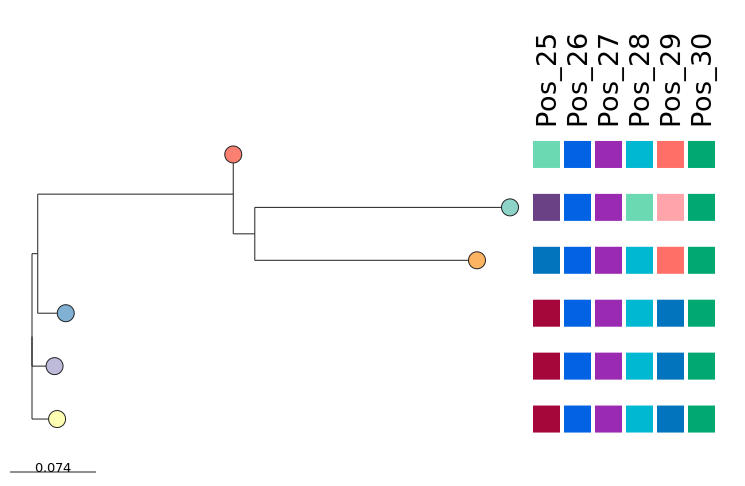

# Microreact Mutations 
## Background
Researchers often wish to visualise alignment data alongside a phylogeny, either to demonstrate a SNP, or a change in a conserved amino acid. This can be either in the context of epidemiology, e.g. to study the distribution of a known variant associated with host specificity in a virus, studying the prevalence of key mechanistic residues across species, or investigating the level of conservation of a given residue. It can also be challenging to visually present this data, as alignments can be so large. 

Microreact, intended for epidemiological research, takes a phylogentic tree as input, alongside a .csv file. Tree nodes are matched to metadata rows based on unique sample names. From there, the user can visualise the metadata alongside the phylogeny as blocks, or generate charts to show the frequency of different variables within each metadata column, and the relationships between them. Microreact also has great in-built features allowing users to create accounts to save their data, and create unique links to share their interactive projects as part of a manuscript. 

We created a short Python script that converts FASTA alignments into .csv files that can be used with Microreact. This allows users to visualise phylogenies on Microreact alongside alignment data, making it straightforward to create informative alignment figures. It also adds corresponding amino acid colours from a defined palette, such that Microreact will remain consistent. 

## Usage
The Python script process.py takes an alignment file in FASTA format: 

```
> Sequence Name 1 
MGCT
> Sequence Name 2 
MCCT
```

And converts it into a .csv, in the format:

```
Sequence Name 1,M,#ff6f68,G,#01a871,C,#eac250,T,#6a4184
Sequence Name 2,M,#ff6f68,C,#eac250,C,#eac250,T,#6a4184
```

This allows for it to be read by Microreact. 

The command for this is (approximately)

`python3 process.py -f ExampleAlignment.fa 2> ExampleOutput.csv`

To visualise your data on Microreact, you will need to provide a tree of your protein/of species (check out https://phylot.biobyte.de/) along with your .csv of alignment data. You can then select specific alignment positions to show as metadata blocks alongside the tree. The colours of the blocks can be changed. This can be customised (as described in the Microreact documentation here https://docs.microreact.org/) and exported as an .svg image.

🚨 The names of the sequences MUST match the names of the nodes of the tree, such that the data can be matched to the tree. 🚨

## Example 
In this repo you'll find an example alignment, tree, and output file. It makes this Microreact here! https://microreact.org/project/mutations 



## Credit 
Microreact is an incredible tool, a huge thank you to the team who created and maintain it. This extension was created by Alannah and Chris Jensen-King; if you use it, please credit it (or at least buy us a drink) :) 
